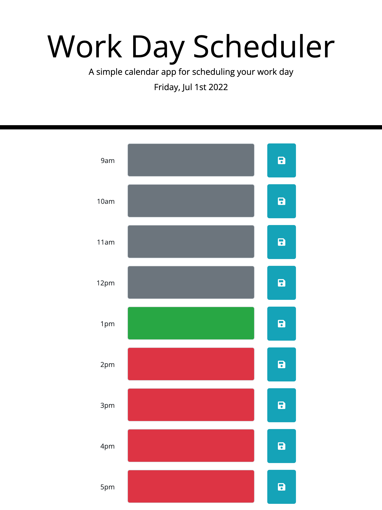

# Word Day Scheduler

## Screenshots
Screenshot of the landing page:

## Description

With many schedulers online and each with different designs, it's difficult to find a minimalistic one that can serve the simple purpose to write and track daily todo's by the hour. This work day scheduler is simple, and color-codes each text input depending on the hour. And it's useful for usage between 9am and 5pm. The current time block is green; past times are in grey; future times are in red. Once you type in a task, just press the "save" button and it won't disappear.

## Future Implementations

Future implementations I'd add are:
- Once a text area fills, remove its ability to scroll and increment its height
- A button to clear a text area
- Give it a calendar look where the user can view every date of the month and populate it

## Code Snippets

## Technologies Used

HTML, CSS, JavaScript, jQuery, Bootstrap, Momentjs, and Git

## Deployment Link

https://laurasierra17.github.io/work-schedule/

## User Information
- [LinkedIn](https://www.linkedin.com/in/laurasierra2022)
- [Portfolio](http://www.laura-sierra.com)